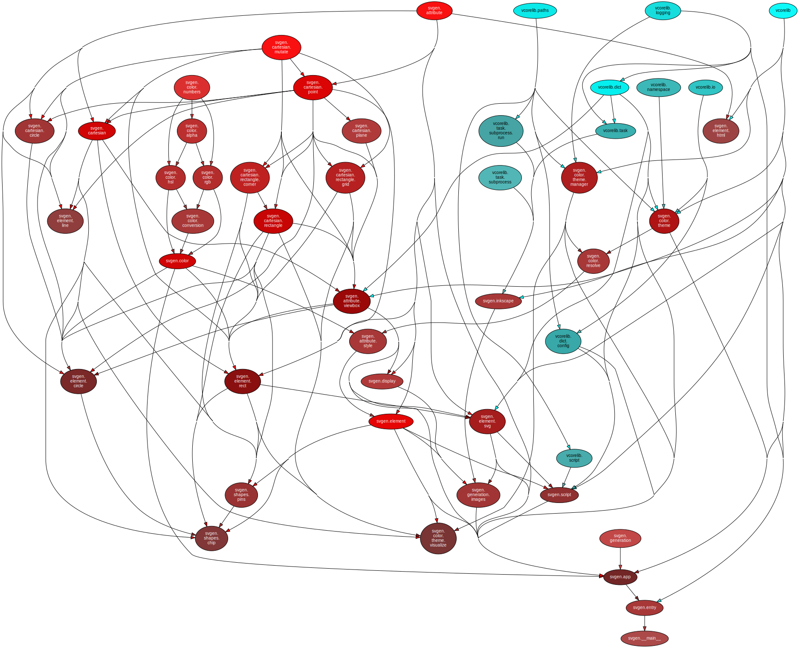

<!--
    =====================================
    generator=datazen
    version=3.1.0
    hash=0f2008348290d597c6a9b73b160cf4f0
    =====================================
-->

# svgen ([0.4.3](https://pypi.org/project/svgen/))

[](https://pypi.org/project/svgen/)

[](https://codecov.io/github/vkottler/svgen)


*A tool for working with scalable vector graphics.*

See also: [generated documentation](https://vkottler.github.io/python/pydoc/svgen.html)
(created with [`pydoc`](https://docs.python.org/3/library/pydoc.html)).

## Python Version Support

This package is tested with the following Python minor versions:

* [`python3.7`](https://docs.python.org/3.7/)
* [`python3.8`](https://docs.python.org/3.8/)
* [`python3.9`](https://docs.python.org/3.9/)
* [`python3.10`](https://docs.python.org/3.10/)

## Platform Support

This package is tested on the following platforms:

* `ubuntu-latest`
* `macos-latest`
* `windows-latest`

# Introduction

This utility provides a means to work on graphics with a programmatic workflow.

# Command-line Options

```
$ ./venv3.8/bin/svgen -h

usage: svgen [-h] [--version] [-v] [-C DIR] [-c CONFIG] [--height HEIGHT]
             [--width WIDTH] [--images] [-o OUTPUT]
             [scripts [scripts ...]]

A tool for working with scalable vector graphics.

positional arguments:
  scripts               scripts to run for composing the SVG document (in
                        order)

optional arguments:
  -h, --help            show this help message and exit
  --version             show program's version number and exit
  -v, --verbose         set to increase logging verbosity
  -C DIR, --dir DIR     execute from a specific directory
  -c CONFIG, --config CONFIG
                        top-level configuration to load (default:
                        'svgen.json')
  --height HEIGHT       height of the document, if not specified by
                        configuration (default: 100)
  --width WIDTH         width of the document, if not specified by
                        configuration (default: 100)
  --images              generate output images
  -o OUTPUT, --output OUTPUT
                        file to write SVG output (default: 'svgen.svg')

```

# Internal Dependency Graph

A coarse view of the internal structure and scale of
`svgen`'s source.
Generated using [pydeps](https://github.com/thebjorn/pydeps) (via
`mk python-deps`).


